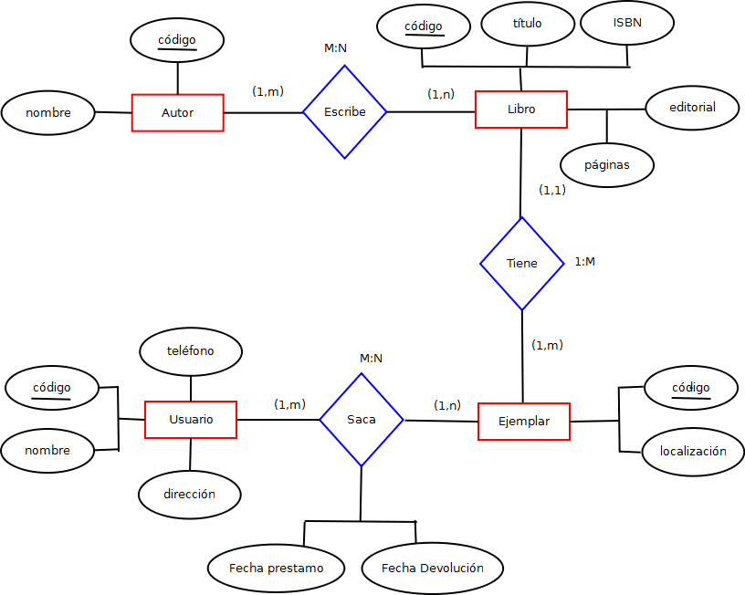

# Tutorial - Bases de datos no relacionales con MongoDB


## Contenido
- **1. Instalación**
- **2. Configuración**
- **3. Ejemplo (Librería) - Base de datos No SQL en MongoDb**
- **4. Referencias**

## 1. Instalación (Windows)

**1.1.** Descargar el archivo de instalación en el sitio oficial de [MongoDB](https://www.mongodb.com/download-center/community)
<center>


**1.2.** Una vez descargado, ejecutar el archivo de instalación y seguir los pasos. 
<center>


<p style='text-align: justify;'
**Recomendación:** No seleccionar la opción <em>**Instalar MongoD como un servicio**,</em> ya que el servicio **mongod** se activará automaticamente cada vez que inicie su sistema operativo y esto podría disminuir el rendimiento de su equipo. Para el ejercicio académico, es buena práctica activar manualmente el servicio únicamente cuando se requiera.


<center>


<p style='text-align: justify;'

Una vez finalice la instalación, se ejecutará automaticamente **MongoDB Compass Community**, una herramienta GUI que nos permitira visualizar y manipular de forma gráfica nuestras bases de datos. La utilizaremos mas adelante.

<center>


## 2. Configuración (Windows)


<p style='text-align: justify;'

Cada vez que utilicemos el servicio, inicialmente debemos  activarlo y posteriormente conectarnos a este. La activación del servicio se puede realizar a través de la consola de comandos (*CMD*) del sistema operativo y la conexión se puede realizar mediante la consola o a través de la herramienta GUI (*MongoDB Compass Community*).


<p style='text-align: justify;'

Para activar el servicio de MongoDB a través de la consola de comandos, necesitamos configurar la ruta donde se encuentra el archivo de activacion para que el sistema operativo lo reconozca.


<p style='text-align: justify;'

**2.1.** Abrir la consola de comandos *CMD* y ejecutar <code>mongod --version</code>. Si no se encuentra configurada la ruta de ubicación del archivo nos debe aparecer lo siguiente. 


<center>


<p style='text-align: justify;'

Para solucionarlo vamos a adicionar la direccion donde se encuentra el archivo de activacion al path de rutas de windows.


<p style='text-align: justify;'

**2.2.** Buscar la carpeta **<em>bin</em>** que contiente el archivo de activacion **<em>mongod</em>** y copiar esa ruta. Normalmente la carpeta se aloja en la dirección <code>C:\Program Files\MongoDB\Server\4.2\bin</code>


<center>


**2.3.** Adicionar esta ruta a las variables de entorno del sistema

<center>


<p style='text-align: justify;'

**2.4.** Verificar nuevamente en la consola de comandos que se encuentre la ruta del archivo de activacion **<em>mongod</em>** <code>mongod --version</code>. Nos debe aparecer lo siguiente.


<center>


<p style='text-align: justify;'

¡Ya esta configurado MongoDB para ejecutarse en la consola de comandos.!


<p style='text-align: justify;'

**2.5.** Ahora, para activar el servicio **<em>mongod</em>**, ejecutamos en la consola de comandos: <code>mongod</code>. 
<center>


<p style='text-align: justify;'

Sin embargo, vemos que el servicio se activa por un momento y luego vuelve a quedar inactivo. Esto pasa porque no encuentra la carpeta donde puede mantener activa la información del servicio. Para solucionarlo, vamos a crear la carpeta **<em>data</em>** en la ruta <code> C:\ </code> y dentro de esta carpeta creamos la carpeta **<em>db</em>**.


<center>


<p style='text-align: justify;'

Una vez creadas las carpetas **<em>data</em>** y **<em>db</em>**, activamos nuevamente el servicio en la consola con el comando <code>mongod</code> y ya deberia permanecer activo.


<center>


<p style='text-align: justify;'

**Nota:** Es importante aclarar que esta consola no debemos cerrarla mientras nos encontremos trabajando con **MongoDB**.


<p style='text-align: justify;'

**2.6.**  Finalmente, cada vez que vayamos a  trabajar con **MongoDB** vamos a realizar dos pasos:
- Activar el servicio **MongoD** con el comando <code>mongod</code>.
- Conectarnos al servicio **MongoD** (*en una nueva consola de comandos*) con el comando <code>mongo</code>.


<center>


<p style='text-align: justify;'

Para verificar que estamos conectados a Mongo podemos ejecutar el siguiente comando:
 <code>show dbs</code>


<center>


<p style='text-align: justify;'

Si queremos conectarnos a Mongo a través de la herramienta GUI (**MongoDB Compass Community**) lo podemos hacer así:


<center>


## 3. Ejemplo (Libreria) - Base de datos No SQL en MongoDB

Ahora vamos a construir en MongoDB, un ejemplo de una base de datos no relacional para una Libreria. A continuación presentamos el modelo entidad-relación correspondiente:

<center>



Para representar el modelo ER de la libreria en MongoDB resulta de gran utilidad presentar una equivalencia del modelo **SQL** con el modelo **NoSQL**. 

|                    **SQL Terms/Concepts**                    |                  **MongoDB Terms/Concepts**                  |
| :----------------------------------------------------------: | :----------------------------------------------------------: |
|                           Database                           |                           Database                           |
|                            Table                             |                          Collection                          |
|                             Row                              |                  Document or BSON Document                   |
|                            Column                            |                            Field                             |
|                         Table joins                          |                 $lookup, embebeded documents                 |
| Primary key: Specify any unique column or column combination as primary key. | Primary key: In MongoDB, the primary key is automatically set to the _id field. |


En MongoDB y en general en los modelos no relacionales hay tres conceptos importantes que debemos tener presentes: **base de datos**, **colecciones** y **documentos**. A continuación para el ejemplo de la Libreria, se presenta un esquema que muestra como se organizará la información a traves de estos tres elementos.

<center>
**MongoDB**


Antes de crear nuestra base de datos vamos a citar algunos comandos que serán de gran utilidad para trabajar con las bases de datos en la consola de MongoDB. 

Comando | Funcionamiento
-- | --
<code>db</code> | Muestra la base de datos actual que estamos utilizando.
<code>show dbs </code> | Muestra las bases de datos que tenemos actualmente.
<code>help</code> | Muestra comandos generales que podemos utilizar.
<code>db.help()</code> | Obtener ayuda con los métodos relacionados a las bases de datos. 

### 3.1. Creación de la base de datos

Para crear una base de datos, utilizamos el comando <code>use Nombre_base_de_datos </code>. Con este comando le estamos diciendo a MongoDB que base de datos vamos a utilizar. Sin embargo, Mongo no va a crear la base de datos hasta que adicionemos como minimo una colección. 
#### 3.1.1. Crear la base de datos de la Libreria

- Crear base de datos 


``` Shell
> use Libreria
> db.createCollection("Autor")
```

- Verificar que se creó correctamente la base de datos
``` Shell
> show dbs
```

- (Opcional) Si requiero eliminar la base de datos actual
``` Shell
> db.DropDatabase()
```

<center>


### 3.2. Adicionar colecciones a la base de datos
Si queremos adicionar colecciones a una base de datos utilizamos:  <code>db.collection("Nombre_colección")</code>. También podemos crear colecciones de forma implícita, insertando documentos con el  comando: <code>db.Nombre_colección.insert({Documento_BSON})</code>.

#### 3.2.1 Crear las colecciones necesarias para la Libreria

- Crear las colecciones Autor, Libro, Usuario y Ejemplar.
  
``` Shell
> db.createCollection("Autor")
> db.createCollection("Libro")
> db.createCollection("Usuario")
> db.createCollection("Ejemplar")
```
- Verificar que se hayan creado correctamente las colecciones en la base de datos.

``` Shell
> show collections
```

- (Opcional) Si requiero eliminar una colección de la base de datos actual
``` Shell
> db.Nombre_Colección.Drop()
```
<center>


### 3.3. Adicionar documentos a las colecciones de la base de datos

Los documentos que se adicionan en las colecciones, son objetos JSON, que mongoDB traduce a objetos binarios (BSON) para hacer mas eficiente operaciones como la busqueda de valores. Estos objetos se componen de parejas Campo-Valor. A continuación presentamos un ejemplo de un documento JSON, que representa la informacion de un usuario. 

``` json
{
    "nombre":"Ivan Delgado",
    "telefono": 2955208,
    "estado": false,
    "direccion":["Direccion1","Direccion2"],
    "fecha_creacion": new Date("12/04/2020")
}
```
Los valores en un documento pueden ser diferentes tipos de datos (Strings, numeros, booleanos, matrices, objetos..).

**Relaciones en MongoDB**

A diferencia de las base de datos SQL, las bases de datos NoSQL, no requieren organizar la información de forma estructurada, lo que puede traer ventajas y desventajas asociadas dependiendo del problema que se quiera resolver. A pesar que en MongoDB no existen relaciones entre elementos, se pueden hacer aproximaciones para los distintos tipos de cardinalidad que pueden encontrarse en un modelo entidad-relación.

- **Relaciones 1 a 1**

Este tipo de información se da, por ejemplo, entre un edificio y su plano, un estudiante y su historia académica, un trabajador y su curriculum...

Para el caso del estudiante y su historia académica, podemos vincular el identificador del libro en el ejemplar, o al revés. También podríamos incrustar un documento dentro de otro y tener toda la información en un único documento. Hay que tener en consideración como va a ser leído, como va a crecer o si es necesario tener en cuenta la atomicidad.

- **Relaciones 1 a N (entendiendo que N son muchos)**

Este tipo de relación se daría por ejemplo entre una ciudad y sus ciudadanos, un concierto y sus entradas, entre otros. 

Si incrustáramos por ejemplo a las personas en el documento inicial, el documento incrementaría su tamaño hasta superar el limite permitido que son 16Mb.

Si incrustamos la información de la cuidad en cada uno de los documentos de la colección persona, vamos a tener una gran probabilidad de generar inconsistencias si tratamos de actualizar la información de la colección ciudad.

Una opción válida sería tener dos colecciones, una que contiene la información de la ciudad y otra que contenga a las N personas, y para cada persona  incrustar un atributo que contenga el id de la ciudad a la que pertenece. A continuación presentamos un ejemplo.

**Colección Ciudades**
``` json
[
    {
        "_id" : 1,
        "nombre":"Bogota",
        "temperatura": 15,
        
    },
    {
        "_id" : 2,
        "nombre":"Cali",
        "Temperatura": 30,
        
    }
]
```

**Colección Personas**
``` json
[
    {
        "nombre":"Andres Perez",
        "edad": 30,
        "Ciudad": 1
    },
    {
        "nombre":"Nicolas Gonzalez",
        "edad": 45,
        "Ciudad": 1
    }
]
```

- **Relaciones 1 a N (entendiendo que N son pocos)**

Al contrario del caso anterior, en ocasiones N pueden ser pocos documentos. Por ejemplo si queremos modelar la relación entre un post y sus comentarios, observamos que no hay muchos comentarios en un mismo Post. (podrían ser del orden de 1 a 10), y como cada comentario esta vinculado exclusivamente a un único Post y rara vez va a ser editado, una buena solución sería incrustar los N comentarios en el post correspondiente. A continuación presentamos un ejemplo.

**Colección Posts**

``` json
[
    {
        "_id":1,
        "Contenido_post": "mensaje posteado",
        "comentarios": [
            {
                "_id":5,
                "comentario":"respuesta_1"
            },
            {
                "_id":6,
                "comentario":"respuesta_2"
            }
        ]
    },
]
```

- **Relaciones N a N (Pocos a Pocos o Muchos a Muchos)**
  

Este tipo de relación, que se daría entre Libros y Autores, o entre Estudiantes y Profesores… es importante analizarla en cada caso concreto, porque en realidad (en estos ejemplos por ejemplo) podrían entenderse como relaciones Pocos a Pocos en gran parte de los casos del mundo real.

  Una opción sería, por ejemplo, incrustar los identificadores de cada uno de ellos en un array de identificadores… pero no es lo ideal, ya que suele crear una vulnerabilidad de inconsistencia a la hora de crear los datos en ambas direcciones, ya que no se mantienen juntos (aunque desde el punto de vista del rendimiento, podría ser interesante).

**Libros**

``` json
[
    {
        "_id":1,
        "titulo": "Historia del tiempo",
        "autores": [3, 7]
    },
]
```

**Autores**

``` json
[
    {
        "_id":3,
        "titulo": "Joseph Fontana",
        "libros": [1, 12, 24]
    },
    {
        "_id":7,
        "titulo": "Gonzalo Ponton",
        "libros": [1]
    }
]
```


  Otra opción (para el ejemplo de los libros y autores) es,  en lugar de un array de identificadores, incrustar el Libro dentro del Autor, pero esto nos hará duplicar libros y será vulnerable en caso de actualización.

**Autores**

``` json
[
    {
        "_id":3,
        "titulo": "Joseph Fontana",
        "libros":[
                    {
                        "titulo": "Historia del tiempo",
                        "Editorial": "Critica"
                    },
                    {
                        "titulo": "El tunel",
                        "Editorial": "Alpha&Omega"
                    },
                ]
    },
    {
        "_id":7,
        "titulo": "Gonzalo Ponton",
        "libros":[
                    {
                        "titulo": "Historia del tiempo",
                        "Editorial": "Critica"
                    }
                ]
    }
]
```

Una tercera alternativa sería tener ambos objetos como objetos de primera clase de un único documento general.

**Autores-Libros**

``` json
[
    {
        "_id":7,
        "autor": "Gonzalo Ponton",
        "libro":{
                    "titulo": "Historia del tiempo",
                    "Editorial": "Critica"
                }
                
    },
    {
        "_id":7,
        "autor": "Joseph Fontana",
        "libro":{
                    "titulo": "Historia del tiempo",
                    "Editorial": "Critica"
                }
                
    },
]
```

- **Conclusión**: 
  
  Es normal pensar que si utilizamos documentos embebidos de mongo estaremos desnormalizando los datos y generando problemas por no respetar la tercera forma normal. Pero en realidad, mientras no dupliquemos los datos, no crearíamos vulnerabilidades.
  - En relaciones **uno a uno** es perfectamente viable embeber los datos de forma segura porque no se duplican los datos.
  - En relaciones **uno a muchos**, funciona bien si embebes los **muchos** en los **unos**.
  - En relaciones **muchos a muchos**, hay que vincularlos a través de un array de identificadores en los documentos. Por algunas razones se podría querer embeber documentos, pero como resultado se duplicaría mucho contenido.

#### 3.3.1. Insertar documentos en las colecciones (Continuemos con nuestro ejemplo de la Libreria...)

Para insertar documentos en las colecciones podemos utilizar los siguientes comandos:

<center>**Comando**</center> | <center>**Funcionamiento**</center>
-- | --
<code>db.NameCollection.insert()</code> | Inserta un documento a la colección
<code>db.NameCollection.insertOne()</code> | Inserta un documento a la colección
<code>db.NameCollection.insertMany()</code> | Inserta múltiples documentos a una colección

- **3.3.1.1.** Insertar algunos documentos en la colección Autor

    ``` json
    db.Autor.insertMany([
        {
            "autor": "Gonzalo Ponton",
            "libros":[]
        },
        {
            "autor": "Ana Villamil",
            "libros":[]
        },
        {
            "autor": "Gabriel Garcia Marquez",
            "libros":[]
        }
    ])
    ```


  Validar que se hayan insertado correctamente los documentos con el comando <code>db.Autor.find().pretty()</code>. Obtendremos como resultado:

    ``` json
    {
        "_id" : ObjectId("5ed302e92c3fc91319be5394"),
        "autor" : "Gonzalo Ponton",
        "libros" : [ ]
    }
    {
        "_id" : ObjectId("5ed302e92c3fc91319be5395"),
        "autor" : "Ana Villamil",
        "libros" : [ ]
    }
    {
        "_id" : ObjectId("5ed330aaa855a6eecfd3f609"),
        "autor" : "Gabriel Garcia Marquez",
        "libros" : [ ]
    }
    ```

- **3.3.1.2.** Insertar algunos documentos en la colección Libro
    ``` json
    db.Libro.insertMany([
        {
            "titulo": "El Tunel",
            "isbn": "978-92-95055",
            "editorial": "Planeta",
            "paginas": 35,
            "autores":[]
        },
        {
            "titulo": "Cien años de soledad",
            "isbn": "978-92-12345",
            "editorial": "Oveja Negra",
            "paginas": 350,
            "autores":[]
        }
    ])
    ```

  Validar que se hayan insertado correctamente los documentos con el comando <code>db.Libro.find().pretty()</code>. Obtendremos como resultado:
    ``` json
    {
        "_id" : ObjectId("5ed3157d2c3fc91319be539a"),
        "titulo" : "El Tunel",
        "isbn" : "978-92-95055",
        "editorial" : "Planeta",
        "paginas" : 35,
        "autores" : [ ]
    }
    {
        "_id" : ObjectId("5ed3157d2c3fc91319be539b"),
        "titulo" : "Cien años de soledad",
        "isbn" : "978-92-12345",
        "editorial" : "Oveja Negra",
        "paginas" : 350,
        "autores" : [ ]
    }
    ```
    Ahora vamos a adicionar a cada libro su(s) autor(es). (Para el ejercicio asumimos que los autores de "El tunel" son Ana Villamil y Gonzalo Ponton y de "Cien años de soledad" Gabriel Garcia Marquez).

    ``` json
    db.Libro.update(
        {"titulo" : "Cien años de soledad"},
        {
            $set : {"autores" : [ObjectId("5ed330aaa855a6eecfd3f609")]}
        }
    )
    ```

    ``` json
    db.Libro.update(
        {"titulo" : "El Tunel"},
        {
            $set : {"autores" : [ObjectId("5ed302e92c3fc91319be5395"), 
                                ObjectId("5ed302e92c3fc91319be5394") ]}
        }
    )
    ```
    Para validar que la información de los autores ha sido actualizada en cada libro, utilizamos el comando <code>db.Libro.find().pretty()</code>. Obtendremos como resultado:

    ``` json
    {
        "_id" : ObjectId("5ed3157d2c3fc91319be539a"),
        "titulo" : "El Tunel",
        "isbn" : "978-92-95055",
        "editorial" : "Planeta",
        "paginas" : 35,
        "autores" : [
                ObjectId("5ed302e92c3fc91319be5395"),
                ObjectId("5ed302e92c3fc91319be5394")
        ]
    }
    {
        "_id" : ObjectId("5ed3157d2c3fc91319be539b"),
        "titulo" : "Cien años de soledad",
        "isbn" : "978-92-12345",
        "editorial" : "Oveja Negra",
        "paginas" : 350,
        "autores" : [
                ObjectId("5ed330aaa855a6eecfd3f609")
        ]
    }
    ```
    Ahora vamos a adicionar a cada autor su(s) libro(s).

    ``` json
    db.Autor.update(
        {"autor" : "Gonzalo Ponton"},
        {
            $set : {"libros" : [ObjectId("5ed3157d2c3fc91319be539a")]}
        }
    )
    ```

    ``` json
    db.Autor.update(
        {"autor" : "Ana Villamil"},
        {
            $set : {"libros" : [ObjectId("5ed3157d2c3fc91319be539a")]}
        }
    )
    ```
    ``` json
    db.Autor.update(
        {"autor" : "Gabriel Garcia Marquez"},
        {
            $set : {"libros" : [ObjectId("5ed3157d2c3fc91319be539b")]}
        }
    )
    ```

    Para validar que la información de los libros ha sido actualizada en cada autor, utilizamos el comando <code>db.Autor.find().pretty()</code>. Obtendremos como resultado:

    ``` json
    {
        "_id" : ObjectId("5ed302e92c3fc91319be5394"),
        "autor" : "Gonzalo Ponton",
        "libros" : [
                ObjectId("5ed3157d2c3fc91319be539a")
        ]
    }
    {
        "_id" : ObjectId("5ed302e92c3fc91319be5395"),
        "autor" : "Ana Villamil",
        "libros" : [
                ObjectId("5ed3157d2c3fc91319be539a")
        ]
    }
    {
        "_id" : ObjectId("5ed330aaa855a6eecfd3f609"),
        "autor" : "Gabriel Garcia Marquez",
        "libros" : [
                ObjectId("5ed3157d2c3fc91319be539b")
        ]
    }
    ```

-  **3.3.1.3.** Insertar algunos documentos en la colección Usuario
  
    ``` json
    db.Usuario.insertMany([
        {
            "nombre": "Juan Perez",
            "telefono": "3145985225",
            "direccion": "cra 5 # 23-22"
        },
        {
            "autor": "Maria Andrade",
            "telefono": "3107985835",
            "direccion": "calle 5 # 2-52"
        }
    ])
    ```
    Validar que se hayan insertado correctamente los documentos con el comando <code>db.Usuario.find().pretty()</code>. Obtendremos como resultado:

    ``` json
    {
        "_id" : ObjectId("5ed30c9a2c3fc91319be5396"),
        "nombre" : "Juan Perez",
        "telefono" : "3145985225",
        "direccion" : "cra 5 # 23-22"
    }
    {
        "_id" : ObjectId("5ed30c9a2c3fc91319be5397"),
        "autor" : "Maria Andrade",
        "telefono" : "3107985835",
        "direccion" : "calle 5 # 2-52"
    }
    ```


- **3.3.1.4.** Insertar algunos documentos en la colección Ejemplar (Vamos a crear dos ejemplares por cada libro, y cada ejemplar estará ubicado en una biblioteca diferente). Los valores que se están insertando en el campo "libro", corresponden al id de los libros previamente insertados.
  
    ``` json
    db.Ejemplar.insertMany([
        {
            "libro": ObjectId("5ed3157d2c3fc91319be539a"), 
            "Localizacion": "Biblioteca Virgilio Barco"
        },
        {
            "libro": ObjectId("5ed3157d2c3fc91319be539a"),
            "Localizacion": "Biblioteca el Tintal"
        },
        {
            "libro": ObjectId("5ed3157d2c3fc91319be539b"), 
            "Localizacion": "Biblioteca Virgilio Barco"
        },
        {
            "libro": ObjectId("5ed3157d2c3fc91319be539b"),
            "Localizacion": "Biblioteca el Tintal"
        },

    ])
    ```

  Validar que se hayan insertado correctamente los documentos con el comando <code>db.Ejemplar.find().pretty()</code>. Obtendremos como resultado:
    ``` json
    {
        "_id" : ObjectId("5ed319a12c3fc91319be539c"),
        "libro" : ObjectId("5ed3157d2c3fc91319be539a"),
        "Localizacion" : "Biblioteca Virgilio Barco"
    }
    {
        "_id" : ObjectId("5ed319a12c3fc91319be539d"),
        "libro" : ObjectId("5ed3157d2c3fc91319be539a"),
        "Localizacion" : "Biblioteca el Tintal"
    }
    {
        "_id" : ObjectId("5ed319a12c3fc91319be539e"),
        "libro" : ObjectId("5ed3157d2c3fc91319be539b"),
        "Localizacion" : "Biblioteca Virgilio Barco"
    }
    {
        "_id" : ObjectId("5ed319a12c3fc91319be539f"),
        "libro" : ObjectId("5ed3157d2c3fc91319be539b"),
        "Localizacion" : "Biblioteca el Tintal"
    }
    ```

- **3.3.1.5.** Vamos a crear una coleccion para registrar la informacion relacionada con los prestamos de los ejemplares.
  ``` Shell
  > db.createCollection("HistorialPrestamos")
  ```

  Insertar algunos documentos en la colección HistorialPrestamos. Cada una de estas inserciones simularan el registro del préstamo de ejemplares. Los valores de los campos "usuario" y "ejemplar", contienen el id de algunos de los documentos de las colecciones de Usuario y Ejemplar.

    ``` json
    db.HistorialPrestamos.insertMany([
        {
            "usuario": ObjectId("5ed30c9a2c3fc91319be5396"), 
            "ejemplar": ObjectId("5ed319a12c3fc91319be539c"),
            "FechaPrestamo": new Date(20/04/2020),
            "FechaDevolucion": new Date(25/04/2020)
        },
        {
            "usuario": ObjectId("5ed30c9a2c3fc91319be5396"), 
            "ejemplar": ObjectId("5ed319a12c3fc91319be539e"),
            "FechaPrestamo": new Date(20/05/2020),
            "FechaDevolucion": new Date(29/05/2020)
        },
        {
            "usuario": ObjectId("5ed30c9a2c3fc91319be5397"), 
            "ejemplar": ObjectId("5ed319a12c3fc91319be539d"),
            "FechaPrestamo": new Date(02/01/2020),
            "FechaDevolucion": new Date(15/01/2020)
        }
    ])
    ```

  Validar que se hayan insertado correctamente los documentos con el comando <code>db.HistorialPrestamos.find().pretty()</code>. Obtendremos como resultado:
    ``` json
    {
        "_id" : ObjectId("5ed3211d2c3fc91319be53a0"),
        "usuario" : ObjectId("5ed30c9a2c3fc91319be5396"),
        "ejemplar" : ObjectId("5ed319a12c3fc91319be539c"),
        "FechaPrestamo" : ISODate("1970-01-01T00:00:00Z"),
        "FechaDevolucion" : ISODate("1970-01-01T00:00:00Z")
    }
    {
        "_id" : ObjectId("5ed3211d2c3fc91319be53a1"),
        "usuario" : ObjectId("5ed30c9a2c3fc91319be5396"),
        "ejemplar" : ObjectId("5ed319a12c3fc91319be539e"),
        "FechaPrestamo" : ISODate("1970-01-01T00:00:00Z"),
        "FechaDevolucion" : ISODate("1970-01-01T00:00:00Z")
    }
    {
        "_id" : ObjectId("5ed3211d2c3fc91319be53a2"),
        "usuario" : ObjectId("5ed30c9a2c3fc91319be5397"),
        "ejemplar" : ObjectId("5ed319a12c3fc91319be539d"),
        "FechaPrestamo" : ISODate("1970-01-01T00:00:00Z"),
        "FechaDevolucion" : ISODate("1970-01-01T00:00:00Z")
    }
    ```
#### 3.3.2. Realizando consultas en MongoDB

Finalmente vamos a realizar algunas consultas sobre nuestra base de datos. 
- **3.3.2.1.** Consultar la información del libro Cien años de Soledad.
    
    ``` json
    db.Libro.findOne({"titulo":"Cien años de soledad"})
    ```
    Resultado:
    ``` json
    {
        "_id" : ObjectId("5ed3157d2c3fc91319be539b"),
        "titulo" : "Cien años de soledad",
        "isbn" : "978-92-12345",
        "editorial" : "Oveja Negra",
        "paginas" : 350,
        "autores" : [
                ObjectId("5ed330aaa855a6eecfd3f609")
        ]
    }
    ```
- **3.3.2.2.** Consultar cuantos ejemplares hay del libro Cien años de Soledad.
    ``` json
    libro = db.Libro.findOne({"titulo":"Cien años de soledad"})
    numEjemplares = db.Ejemplar.find({"libro":libro._id}).count()
    print ("El libro "+libro.titulo+" tiene "+numEjemplares+" ejemplares")
    ```
    Resultado:
    ``` json
    El libro Cien años de soledad tiene 2 ejemplares
    ```
- **3.3.2.3.** Consultar que libros le han prestado a Juan Perez
    ``` json
    juan = db.Usuario.findOne({"nombre":"Juan Perez"})
    db.HistorialPrestamos.find({"usuario":juan._id}).forEach(
        (prestamo)=>{
            ejemplar = db.Ejemplar.findOne({"_id":prestamo.ejemplar})
            libro = db.Libro.findOne({"_id":ejemplar.libro})
            print("Libro: " + libro.titulo)
        }
    )
    ```
    Resultado:
    ``` json
    Libro: El Tunel
    Libro: Cien años de soledad
    ```
**Nota:** A través de la herramienta GUI (Mongo Compass Community), puede gestionar casi que al mismo nivel de detalle toda la información relacionada con las bases de datos, colecciones y documentos. A continuación podrá observar desde la interfaz grafica la construcción de la base de datos de la Librería.

<center>


  ## 4. Referencias
  1. [Guia de instalación y configuración](https://www.youtube.com/watch?v=2KMQdqDk9e8)
  2. [Guia de referencia y documentación oficial](https://docs.mongodb.com/manual/reference)
  3. [Relaciones en MongoDB](https://blog.findemor.es/2015/06/aprender-a-usar-mongodb-guia-5)
